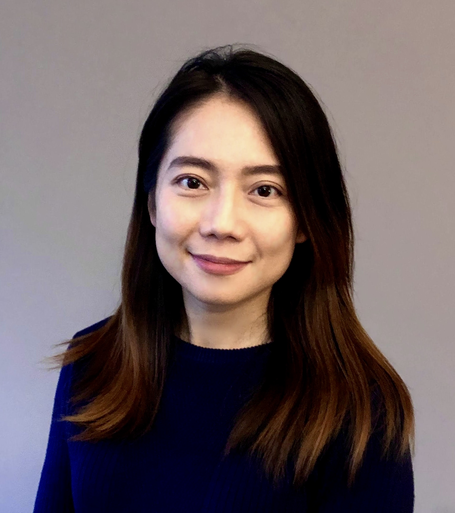

{: width="300px" }

👋 Hi, I’m Yiting — a physicist-turned-data scientist with a curious mind and a love of exploration. I earned my PhD in Physics on full scholarships, and have worked across academia and industry in the US, Switzerland, France, Japan, and now the Netherlands.

💻 My path into data science grew from a desire to find structure in complexity and use data to drive better decisions. Today, I work in tech at Booking.com, focusing on experimentation, machine learning, and insights that create business impact.

💥 During my days as a physicist, one of the most memorable experiences was working at CERN — where we smashed particles together to recreate tiny echoes of the Big Bang, in hopes of understanding the building blocks of our universe.

⛰️ Outside of work, I find joy in movement and nature — climbing, skiing, and exploring mountain trails, always on the lookout for new ways to experience this ever-changing world. I believe learning happens everywhere, and sharing is my way of giving back.

🖊️ This site is where I collect and share reflections, learning, and resources on data and science.

> “In the end, we’ll all become stories.” — Margaret Atwood
